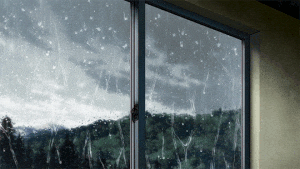

# @dot-event/view

dot-event dom views



## Install

```bash
npm install dot-event @dot-event/view
```

## Setup

```js
const dot = require("dot-event")()
require("@dot-event/view")(dot)
```

## Usage

First create your view composer:

```js
export default function(dot) {
  if (dot.myView) {
    return
  }
  dot.view("myView", { render, update })
}

function render() {
  return document.createElement("DIV")
}

function update(prop, arg) {
  arg.element.innerHTML = arg.value
}
```

Then use it:

```js
require("./myView").default(dot)

dot.myView() // creates element from `render`
dot.myView({ value: "hello" }) // updates element from `update`
```

## Attaching elements

The example above doesn't attach the element to the DOM. You can do that one of two ways with the **initial view call**:

### Via selector

```js
dot.myView({ selector: "#myId" })
```

### Via prop

When props are passed to the view, the view component uses them to try to find an element ID:

```js
dot.myView("myId")
```

### How it's attached

When a matching element is found from the selector option or props, that element is **replaced** with the element you return from `render`.

You may also optionally return a new element from `update` to replace it.

## SSR

When you attempt to attach a view to an element that already exists and has content, the view will **only call `update`** and will add an `ssr: true` option to the [emit argument](https://github.com/dot-event/dot-event2#emit-argument).

## Props

The `view` composer automatically adds the name of the view to [the `prop` array](https://github.com/dot-event/dot-event2#props) within the `render` or `update` function.

It is a typical pattern to use `prop.join(".")` as your div id. Because the view name is automatically added to props, you can keep passing props down to your sub views without modifying or thinking too much about it.

In this way, we leverage props to get great element identifiers and [logging](https://github.com/dot-event/log2) without any effort!

## Related composers

| Library    | Description    | URL                                     |
| ---------- | -------------- | --------------------------------------- |
| controller | DOM controller | https://github.com/dot-event/controller |
| el         | DOM elements   | https://github.com/dot-event/el         |
| render     | SSR render     | https://github.com/dot-event/render     |
